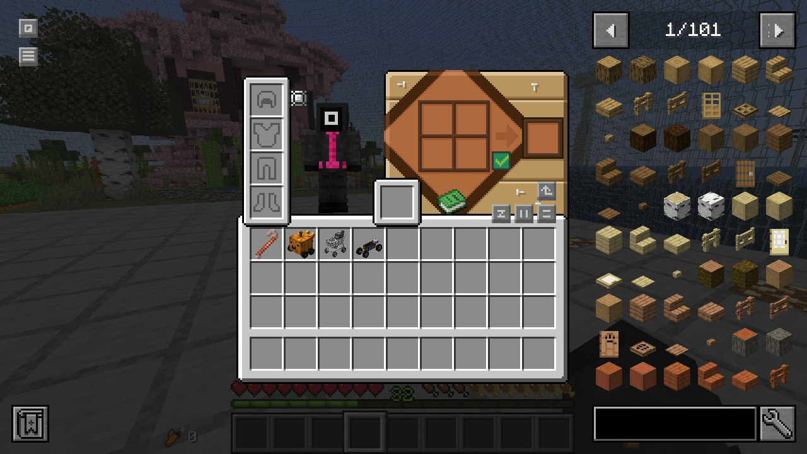

- [::simple-icons:modrinth:: Страница мода на Modrinth](https://modrinth.com/mod/jei)

## ::majesticons:text:: Описание

JEI (Just Enough Items) - семейство модов, так же известное как TMI, NEI или REI, позволяющее просматривать все доступные предметы и их крафты, а так же, при наличие соответствующих прав, брать эти предметы из креатива.

::: note Интересный факт
Самая первая версия модов этого семейства TMI (Too Many Items) появилась в 2011, на заре популярности Minecraft.
В то время в игре было крайне не удобное креативное меню выбора блоков, а так же не существовало команд для переключения режимов игры, погоды и прочего.
TMI поставлял такую возможность.
:::

## ::pajamas:appearance:: Внешний вид

## ::tabler:click:: Использование

### ::mdi:location:: Местоположение

JEI всегда появляется при взаимодействии с любым интерактивным блоком, таким как верстак, печка или ваш инвентарь.

### ::mdi:cog:: Возможности

#### ::material-symbols:search-rounded:: Поиск

Внизу находится многофункциональная строка поиска. Она действует как фильтр по названию предмета/блока в стандартном режиме.
Например, вы можете начать писать `шерс` и будут выведены все блоки, которые в названии имеют эту часть, т.е. вы увидите все возможные цвета шерсти.

Поиск имеет расширенные возможности. Например, доступен поиск по предметам конкретного мода или по тегам.
Для поиска по моду необходимо указать в начале символ `@` и id мода.
К примеру, если указать `@create` - получите список всех предметов мода Create.

#### ::uil:table:: Просмотр крафта

- Нажмите левой кнопкой мыши по любому предмету в списке чтобы увидеть способы его создания.
- Нажмите правой кнопкой мыши по любому предмету в списке чтобы увидеть рецепты, в которых он используется.

При настройках управления по умолчанию, вы так же можете навести курсор на предмет в вашем инвентаре и нажать <kbd>R</kbd> чтобы увидеть способы создания этого предмета.
Либо нажмите <kbd>U</kbd> чтобы увидеть применение этого предмета в других крафтах.
