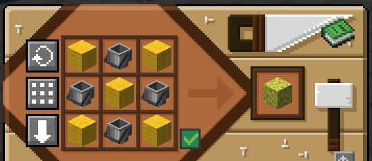
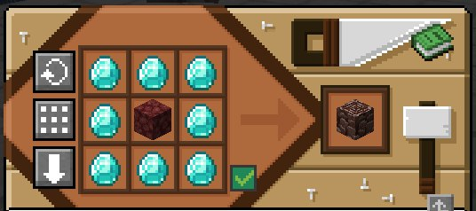
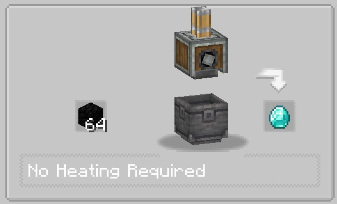
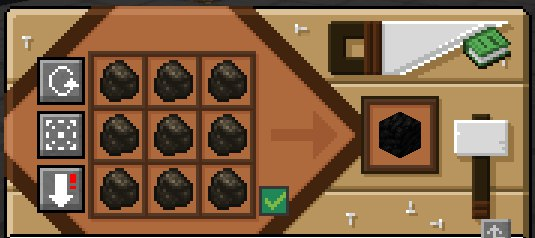

::: info Обратите внимание
Вы так же можете просматривать [все доступные крафты при помощи JEI](/help/jei.md), который установлен на этом сервере
:::

## Дополнительные крафты

Для упрощения игрового процесса, т.к. данный сервер не концентрируется на аспекте выживания, были добавлены дополнительные крафты.

### Губка

### Незеритовый обломок

В общей сумме вам потребуется 32 алмаза, 4 адских камня и 4 золотых слитка чтобы получить незеритовый слиток.

### Алмаз

Используйте пресс из мода Create чтобы сжать 64 угольных блока в алмаз.
Эта операция потребует от вас 576 угля.
Обратите внимание, угольный блок теперь может быть создан и из древесного угля.

### Угольный блок

